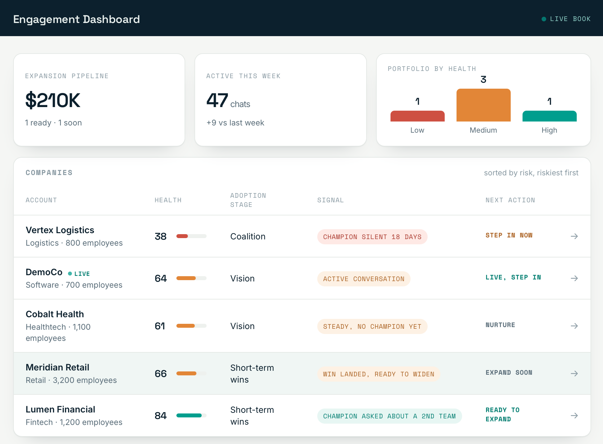
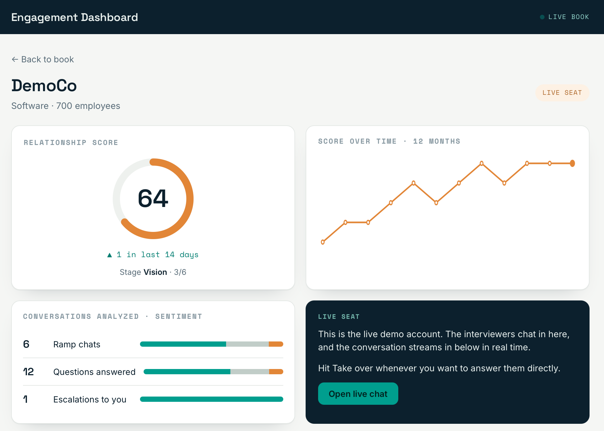
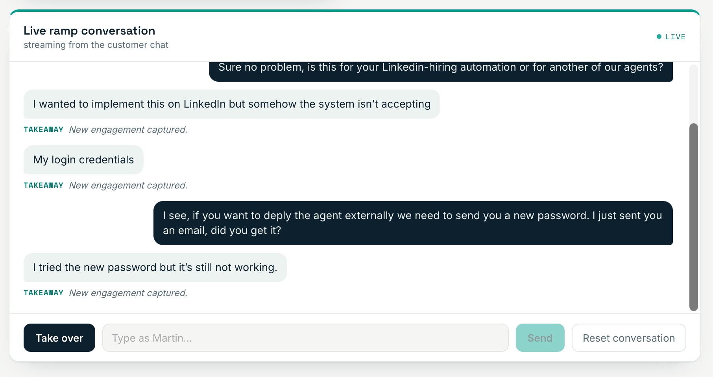
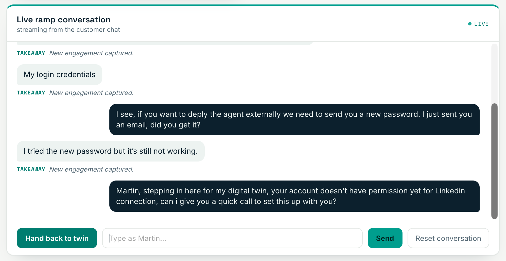
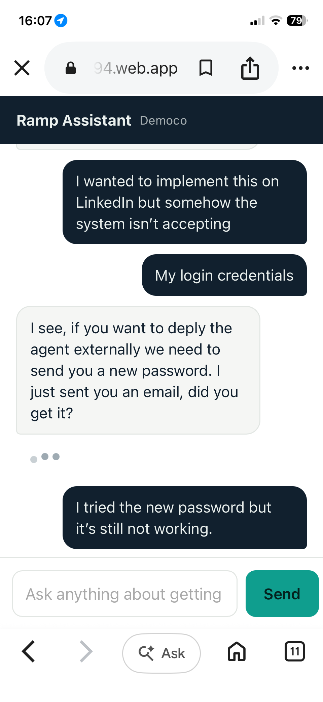

# Engagement OS

A two-sided engagement console for AI product adoption. Customers ramp through a chat assistant trained on a deployment playbook; the engagement manager sees every conversation distilled into account health and a clear next action: step in, follow up, or expand.

Built to solve a problem I lived running enterprise pilots: adoption stalls quietly, and by the time you notice, the account is already gone. This is the instrument that catches it early.

**Live demo:** https://engagement-os-c0294.web.app

## Screenshots

| Engagement cockpit | Account detail |
| --- | --- |
|  |  |

| Live ramp conversation | Human takeover |
| --- | --- |
|  |  |

**Customer ramp chat (mobile)**



## What it does

**Customer side.** A single chat at a shareable link. The customer talks to a digital twin (Claude) trained on the ramp playbook, which answers in the deployment manager's voice and resolves most onboarding questions autonomously.

**Engagement side.** A cockpit that streams every conversation in real time, distills each message into a one-line takeaway, scores account health, and surfaces the next best action per account. The manager can take over any conversation with one click; the twin goes silent and the human answers directly.

The thesis: AI handles the toil, the human shows up for the moment that matters, and the back end turns adoption into revenue.

## Features

**Customer ramp assistant**
- One-link chat, no login friction, mobile-first
- A digital twin trained on a ramp playbook, answering in the deployment manager's voice
- Resolves common onboarding questions autonomously, replies kept short by design
- Guardrails: never invents pricing, policies, or commitments; routes high-stakes questions to a human

**Engagement cockpit**
- Live conversation stream with per-message distilled takeaways
- Account health scoring with a 12-month trend and adoption stage
- Portfolio view: book health, expansion pipeline, riskiest accounts first
- Next best action per account: step in, follow up, or expand
- One-click human takeover, with the twin going silent until the manager hands back
- Reset to a clean slate between sessions

## Architecture

```
Customer chat (web, mobile)
        |
        v
Firestore  <-->  Cloud Function (onCustomerMessage)
        |              |
        |              +-- calls Claude with the twin skill file
        |              +-- distills a takeaway, respects human-takeover mode
        v
Engagement cockpit (live listeners, takeover, reset)
```

- **Firestore** holds conversations and per-account state (health, mode, takeaways) and pushes live updates to the cockpit.
- **A Cloud Function** triggers on each customer message: if the account is in AI mode, it calls Claude with the twin skill file and writes the reply; it distills a takeaway either way; it stays silent when the manager has taken over.
- **The twin's voice and knowledge** live in a single skill file, so behavior is editable without touching code.

## Repo layout

```
firebase.json          Hosting + Functions + Firestore config
firestore.rules        Access rules (demo-grade; production scopes to auth)
functions/
  index.js             onCustomerMessage trigger, Claude call, distillation
  twin-skill.md        The assistant's voice and ramp knowledge
public/
  index.html           Engagement cockpit
  chat.html            Customer ramp chat
```

## Stack

| | |
| --- | --- |
| Backend | Firebase Cloud Functions v2 (Node) |
| Data and realtime | Firestore |
| Hosting | Firebase Hosting |
| AI | Anthropic API (Claude) |
| Front end | Vanilla HTML, CSS, JS, no framework |

## Design notes
- The cockpit's showcase data is curated; the live conversation, takeover, and reset are wired to Firestore in real time.
- Replies are capped short by design, fast and human over long and eloquent.
- The guardrails are a deliberate answer to the well-known risk of assistants fabricating policy: the AI handles safe, repetitive ramp questions, and anything that creates a commitment routes to a human.

## Status
A working demo, deployed and live. Built solo, end to end.
